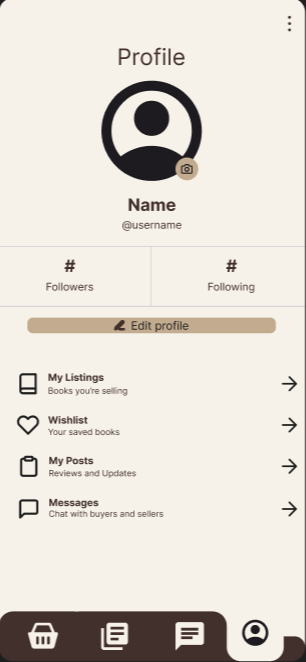
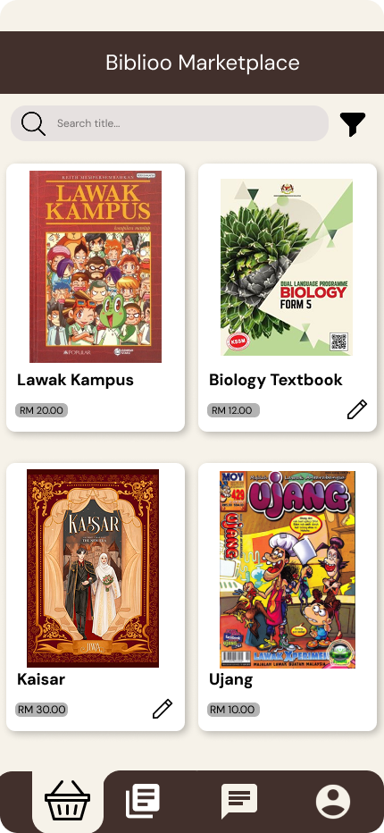

# Biblioo – Mobile Book Marketplace and Community Platform
## Group Members
1. Nor Azreen Binti Asari (2217638)
2. Nur Irdina binti Abd Rahman (2213414)
3. Nur Alifah Ilyana Binti Mohd Zaman (2217466)

## Introduction
Biblioo is a mobile application designed to provide readers with a unified platform to buy and sell physical books while engaging in a social reading community. The application combines a peer-to-peer book marketplace with a community feed where users can share book reviews, recommendations, and reading experiences.

By integrating marketplace functionality with social interaction, Biblioo aims to simplify the process of discovering books, connecting with fellow readers, and giving physical books a second life. The system leverages Firebase services for user authentication, real-time data storage, image handling, and in-app messaging, ensuring a scalable and responsive user experience.

## Objectives
The main objectives of Biblioo are as follows:

- To provide a simple and secure platform for users to buy and sell physical books by category.
- To enable users to list books with images, descriptions, and pricing information.
- To allow direct communication between buyers and sellers through in-app chat.
- To create a community feed where users can share book reviews, recommendations, and reading-related posts.
- To encourage interaction and discovery among readers through a combined marketplace and social environment.
- To utilize Firebase as a backend solution for efficient authentication, data management, and media storage.

## Target Users
Biblioo is designed for a wide range of book enthusiasts, including:

- Students who wish to buy affordable second-hand books or sell books they no longer need.
- Casual readers looking to discover new books through recommendations and community discussions.
- Avid readers who enjoy sharing reviews, opinions, and reading experiences.
- Individuals interested in sustainable reading practices by reusing and reselling physical books.
- Small-scale independent sellers who want a simple platform to reach book buyers.

The application is suitable for users who prefer a mobile-based solution that combines both e-commerce and social networking features in a single, easy-to-use system.

## Features & Functionalities
1. User Management & Authentication
- Firebase Auth: Support for Email/Password and Google Sign-in.
- User Profiles: Customizable profiles showing the user's "Bookshelf" (listings), "Read List" (reviews), and follower count.

2. Marketplace (P2P Commerce)
- Smart Listing: A form to upload book images (Firebase Storage), title, ISBN, condition, and price.
- Search & Filter: Category-based browsing (e.g., Fiction, Textbooks, Sci-Fi) and keyword search.
- Wishlist: Save books to a "Favorites" list for future purchase.

3. Community & Social Feed
- Dynamic Feed: A scrollable timeline of book reviews and "Bookstagram" style photos.
- Interactions: Users can like, comment, and share posts.
- Book Reviews: A dedicated post type with star ratings and "Currently Reading" status updates.

4. Communication System
- Real-time Chat: Integrated Firestore-based messaging between buyers and sellers.
- Push Notifications: Alerts for new messages, price drops on wishlisted books, or social interactions (Cloud Messaging).

## UI Mockup
1. User Profile Screen  
   
2. Book Marketplace Screen  
   
4. Community Screen  
5. 

   
## Architecture / Technical Design
Biblioo is developed as a hybrid mobile application using Flutter, following a client–backend architecture with Firebase as the backend-as-a-service (BaaS). The architecture is designed to separate concerns between the user interface, application logic, and data services to ensure maintainability and scalability.  
The application is structured into three main layers:
1. Presentation Layer (UI Layer)
This layer handles all user-facing components and interactions. It consists of Flutter widgets that represent screens such as authentication, marketplace listings, book details, community feed, and chat screens.  
Key responsibilities:
- Rendering UI components using Flutter widgets
- Handling user input through forms and buttons
- Navigating between screens using route-based navigation
- Displaying real-time updates from Firestore streams

2. Application Logic Layer (Controller / State Management)
This layer manages the business logic and application state. It acts as a bridge between the UI and Firebase services.  
Key responsibilities:
- Managing authentication state (logged in / logged out)
- Handling marketplace logic such as creating listings, saving wishlists, and filtering books
- Managing social interactions such as likes, comments, and post creation
- Controlling chat message flow and conversation state
State management is handled using Provider, which allows shared application state (e.g. current user, listings, feed data) to be accessed efficiently across widgets without excessive rebuilding.

3. Backend & Services Layer (Firebase)
Firebase provides all backend services required by the application, reducing the need for a custom server.  
Firebase services used:
- Firebase Authentication for secure user login (Email/Password and Google Sign-In)
- Cloud Firestore as the primary NoSQL database for users, books, posts, chats, and interactions
- Firebase Storage for storing book images and post media
- Firebase Cloud Messaging (FCM) for push notifications related to messages, wishlist updates, and social interactions
  
This architecture ensures real-time synchronization, supports peer-to-peer interactions, and allows the application to scale as the number of users grows.

## Data Model
Biblioo uses Cloud Firestore, a NoSQL document-based database. Data is organized into collections and documents, designed to support marketplace, social, and messaging features efficiently.

1. Users Collection (users)  
Stores user profile and account-related information.

Fields:
- userId (String)
- name (String)
- email (String)
- profileImageUrl (String)
- bio (String)
- followersCount (Number)
- followingCount (Number)
- createdAt (Timestamp)

2. Books Collection (books)  
Stores all book listings created by users for sale.

Fields:
- bookId (String)
- sellerId (String, reference to users)
- title (String)
- author (String)
- isbn (String)
- category (String)
- condition (String)
- price (Number)
- description (String)
- imageUrls (Array of Strings)
- status (String: available / sold)
- createdAt (Timestamp)

3. Wishlist Collection (wishlists)  
Stores books that users have saved for future reference.

Fields:
- wishlistId (String)
- userId (String)
- bookId (String)
- createdAt (Timestamp)

4. Posts Collection (posts)  
Stores community feed content such as reviews, recommendations, and reading updates.

Fields:
- postId (String)
- userId (String)
- postType (String: review / recommendation / status)
- content (String)
- rating (Number, optional)
- imageUrl (String, optional)
- likesCount (Number)
- createdAt (Timestamp)

5. Comments Collection (comments)  
Stores comments on community posts.

Fields:
- commentId (String)
- postId (String)
- userId (String)
- content (String)
- createdAt (Timestamp)

6. Chats Collection (chats)  
Represents chat sessions between buyers and sellers.

Fields:
- chatId (String)
- participants (Array of userIds)
- bookId (String)
- lastMessage (String)
- updatedAt (Timestamp)

7. Messages Subcollection (chats/{chatId}/messages)   
Stores individual chat messages within a chat session.

Fields:
- messageId (String)
- senderId (String)
- messageText (String)
- createdAt (Timestamp)
## Flowchart/ Sequence Diagram
## Final UI Screenshots
1. Profile  
<figure>

   <figcaption>User profile screen</figcaption>
</figure>

2. Marketplace  
<figure>

   <figcaption>Marketplace Homescreen</figcaption>
</figure>

<figure>

  <figcaption>Book Details</figcaption>
</figure>

<figure>

  <figcaption>Edit Book Details</figcaption>
</figure>

<figure>

  <figcaption>Add New Book</figcaption>
</figure>

4. Community and Chat  
   

   
## Summary of achieved features
The following core features have been successfully implemented and integrated into the Biblioo mobile application:
- **User Authentication and Profiles**
    Users can register and log in using email or Google sign-in. Each user has a personalised profile with a username, bio, and profile picture.
- **Dynamic Book Marketplace**
  A real-time marketplace allows users to browse available books, search by title, and filter listings by categories such as Fiction, Textbooks, and Sci-Fi.
- **Seller Listing Management**
   Users can list books for sale by providing images, descriptions, prices, and condition details. Sellers are able to edit and manage their own listings.
- **Interactive Book Details**
   Each book includes a detailed view with high-quality images. Pinch-to-zoom functionality is provided through an interactive image viewer.
- **Social and Community Features**
   The application includes an “Upcoming Events” section and a chat list interface to support communication between buyers and sellers.
- **Wishlist and Personal Tracking**
   Users can save favourite books to a wishlist and view their active sales through a “My Listings” section.

## Technical explanation
Biblioo is developed using a modern mobile application architecture that supports real-time data updates and cross-platform deployment.
- **Frontend Framework**
  The application is built using Flutter and Dart. Responsive layouts are handled using LayoutBuilder and orientation-based logic to support different screen sizes.
- **State Management**
  The Provider pattern is used to manage authentication state and shared application data consistently across screens.
- **Backend and Database**
  Firebase services are used as the backend solution. Firebase Authentication handles secure user login, while Cloud Firestore is used for storing book listings and user-related data.
- **Image Handling**
  Book listing images are hosted using the ImgBB API, while Firebase Storage is used for managing user profile images.
- **Asynchronous and Real-Time Updates**
  StreamBuilder is used to enable real-time updates for book listings and notifications, ensuring that users always see the most recent data.

## Limitations and future enhancements
### Known Limitations
- Events section is static and does not support user registration
- Chat feature is currently UI-based and not connected to a real-time backend
- Some event images are stored locally instead of being dynamically loaded
- Certain Firestore queries require manual index creation

### Future Enhancements
- Real-time chat with push notifications
- In-app payment integration
- Dynamic event posting and RSVP functionality
- Expanded social features such as reviews and follower systems
- Advanced filters including price range and location-based search
  
## References
